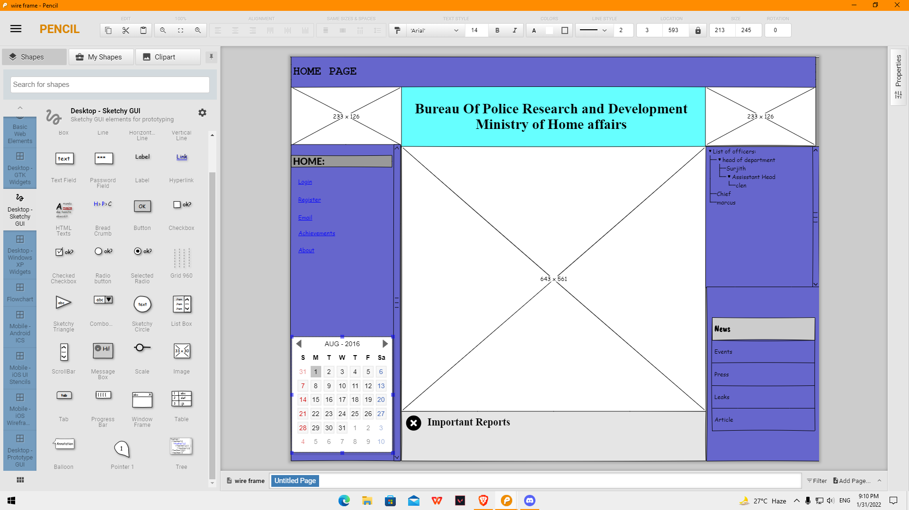
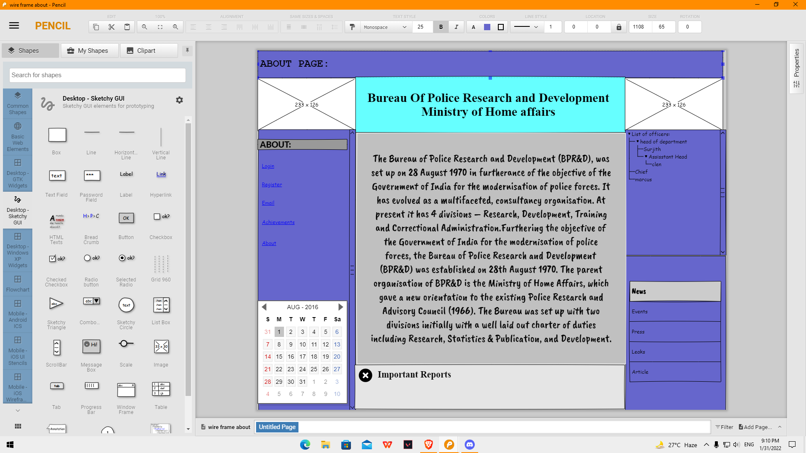
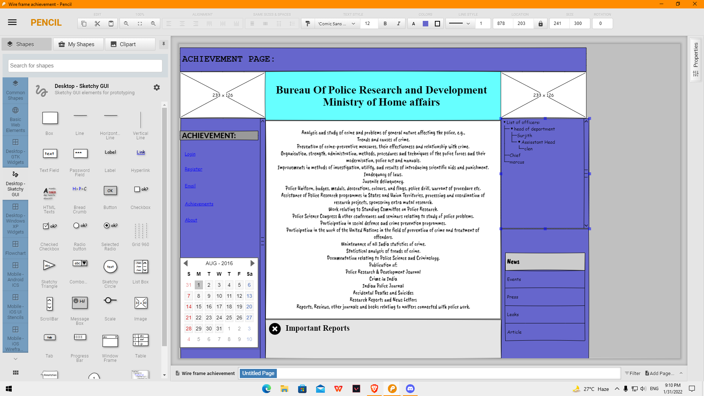

# Wire frame for a website

## AIM:
To design a wire frame for a website.

## DESIGN STEPS:

### Step 1:
Create a New document.

### Step 2:
Resize the canvas.

### Step 3:
Save the document and export the file as Single web page with Clickable Prototype HTML Template.

## OUTPUT:
### Home page:

### About page:

### Achievement page:

## Result:
Thus a wire frame is designed for a given website.
